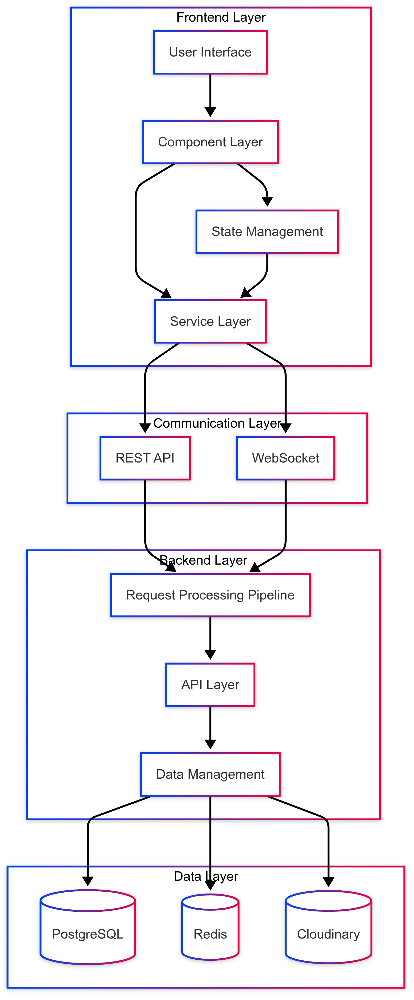

# Architecture description

## App Structure

The structure of the program follows a multiple-level layer architecture, and the code compression structure is as follows:

1. Frontend Architecture
2. Backend Architecture



---

# Frontend Architecture

## Overview

The Frontend Layer handles user interactions, state management, and UI rendering while ensuring responsive and efficient communication with the backend services.

## Core Technologies

- **ReactJS**

  - Primary UI framework
  - Component-based architecture
  - Virtual DOM management
  - JSX templating

- **Material UI**

  - UI components

- **Axios**

  - HTTP client
  - Request/response interceptors
  - API integration
  - Error handling

- **WebSocket**

  - Real-time communications
  - Event-driven updates
  - Bi-directional data flow

- **Nginx**

  - Application serving
  - Static file handling
  <!-- - Reverse proxy -->

- **React Router**
  - Route management
  - Navigation handling
  - Route guards
  - Dynamic routing

## Architecture Components

### 1. Component Layer

#### Core Components

- Reusable UI elements
- Component composition
- Props management
- Event handling

#### Page Components

- Route-specific views
- Layout management
- Page-level state
- Navigation handling

### 2. State Management

#### Context API Implementation

- Global state containers
- State providers
- Custom hooks
- State selectors

#### WebSocket Client

- Connection management
- Event listeners
- Notification handling
- Message handling
- Reconnection strategy

### 3. Service Layer

#### API Services

- RESTful API integration
- Request/response handling
- Error management

---

# Backend Architecture

## Overview

The Backend Layer serves as the server-side component responsible for processing client requests, implementing business logic, and managing data operations.

## Core Technologies

- **ExpressJS**
  - Primary web framework for handling HTTP requests and responses
  - Middleware management and routing
- **WebSocket (ws)**
  - Enables real-time bidirectional communication
  - Handles live updates and notifications

## Architecture Components

### 1. Request Processing Pipeline

#### Request Validator

- JWT Authorization token validation
- Schema validation for request payloads
- Input sanitization for security
- CORS policy management
- Request logging and monitoring

#### Authentication System

- JWT-based authentication and authorization

### 2. API Layer

#### Routes

- Defined API endpoints
- HTTP method handlers
- Middleware integration

#### Controllers

- Business logic implementation
- Request/response handling
- Service orchestration
- Error management

### 3. Data Management

#### Database Integration

- Sequelize ORM integration
- Database models and schemas
- Migration management
- Data validation

#### Caching System

- Redis implementation
- Cache invalidation strategies
- Performance optimization
- Frequently accessed data management

### 4. Data Layer

#### PostgreSQL (Primary Database)

- Relational data storage
- Complex queries and relationships
- Data integrity and constraints
- Structured data management

#### Redis (Caching & Real-time)

- Cache storage
- Real-time data handling
- Performance optimization

#### Cloudinary (Media Storage)

- Image storage
- Secure media delivery

## Key Features

### 1. RESTful API Design

- Consistent endpoint naming
- Standard HTTP methods usage
- Resource-oriented architecture
- Clear request/response formats

### 2. Security Implementation

- Comprehensive authentication flow
- Authorization mechanisms
- Data encryption
- Security best practices

### 3. Data Handling

- Input validation
- Error handling
- Response formatting
- Data transformation

### 4. Performance Optimization

- Caching strategies
- Query optimization
- Response compression

---

## Database Model Design

## Core Models

### User

- Handles user authentication and profile information

```javascript
{
    id: UUID (PK),
    username: STRING(50) UNIQUE,
    email: STRING(255) UNIQUE,
    password_hash: STRING(255),
    firstName: STRING(100),
    lastName: STRING(100),
    dob: DATEONLY,
    gender: ENUM('male', 'female', 'other', 'prefer not to say'),
    country: STRING(2),
    language: STRING(2),
    bio: TEXT,
    avatar_url: STRING(255),
    website_url: STRING(255),
    location: STRING(100),
    created_at: TIMESTAMP,
    updated_at: TIMESTAMP,
    last_login: TIMESTAMP,
    is_verified: BOOLEAN,
    is_active: BOOLEAN
}
```

### Pin

- Represents user-created pins

```javascript
{
    id: UUID (PK),
    user_id: UUID (FK -> users.id),
    title: STRING(255),
    description: TEXT,
    image_url: STRING(255),
    external_url: STRING(255),
    board_id: UUID (FK -> boards.id, nullable),
    created_at: TIMESTAMP,
    updated_at: TIMESTAMP
}
```

### Board

- Collections of pins

```javascript
{
    id: UUID (PK),
    user_id: UUID (FK -> users.id),
    name: STRING(100),
    is_private: BOOLEAN,
    cover_image_url: STRING(255),
    created_at: TIMESTAMP,
    updated_at: TIMESTAMP
}
```

## Relationship Models

### BoardPins (Junction Table)

- Manages many-to-many relationship between boards and pins

```javascript
{
    board_id: UUID (PK, FK -> boards.id),
    pin_id: UUID (PK, FK -> pins.id),
    created_at: TIMESTAMP
}
```

### Followers

- Handles user follow relationships

```javascript
{
    follower_id: UUID (PK, FK -> users.id),
    following_id: UUID (PK, FK -> users.id),
    created_at: TIMESTAMP
}
```

## Interaction Models

### Comment

- User comments on pins

```javascript
{
    id: UUID (PK),
    pin_id: UUID (FK -> pins.id),
    user_id: UUID (FK -> users.id),
    content: TEXT,
    created_at: TIMESTAMP,
    updated_at: TIMESTAMP
}
```

### CommentReply

- Replies to comments

```javascript
{
    id: UUID (PK),
    comment_id: UUID (FK -> comments.id),
    user_id: UUID (FK -> users.id),
    content: TEXT,
    created_at: TIMESTAMP,
    updated_at: TIMESTAMP
}
```

### Like (Polymorphic)

- Handles likes for both pins and comments

```javascript
{
    id: UUID (PK),
    user_id: UUID (FK -> users.id),
    likeable_id: UUID,
    likeable_type: STRING,
    created_at: TIMESTAMP
}
```

## Key Features

- UUID for all primary keys
- Timestamp tracking for all models
- Soft deletion where appropriate
- Proper indexing on foreign keys and frequently queried fields
- Cascade deletion for dependent relationships

## Indexes

```sql

CREATE INDEX idx_users_id ON users(id);
CREATE INDEX idx_users_username ON users(username);
CREATE INDEX idx_users_email ON users(email);
CREATE INDEX idx_pins_user_id ON pins(user_id);
CREATE INDEX idx_boards_user_id ON boards(user_id);
CREATE INDEX idx_board_pins_board_id ON board_pins(board_id);
CREATE INDEX idx_board_pins_pin_id ON board_pins(pin_id);
CREATE INDEX idx_comments_pin_id ON comments(pin_id);
CREATE INDEX idx_comments_user_id ON comments(user_id);
CREATE INDEX idx_likes_likeable ON likes(likeable_id, likeable_type);
```

## Constraints

### Unique Constraints

- `boards`: Composite unique constraint on (`user_id`, `name`)
- `followers` Composite primary key constriant on (`follower_id`, `following_id`)
- `board_pins` Composite primary key constraint on (`board_id`,`pin_id`)

### Foreign Key Constraints

- `boards.user_id` → `users.id` (CASCADE DELETE)
- `pins.user_id` → `users.id` (CASCADE DELETE)
- `pins.board_id` → `boards.id` (SET NULL)
- `comments.user_id` → `users.id` (CASCADE DELETE)
- `comments.pin_id` → `pins.id` (CASCADE DELETE)
- `board_pins.board_id` → `boards.id` (CASCADE DELETE)
- `board_pins.pin_id` → `pins.id` (CASCADE DELETE)

### Check Constraints

- `users.dob`: Must be at least 13 years old
- `users.gender`: Must be one of ('male', 'female', 'other', 'prefer not to say')
- `users.language`: Must be 2 characters
- `users.country`: Must be 2 characters

### Not Null Constraints

- `users.username`
- `users.email`
- `pins.title`
- `pins.image_url`
- `boards.name`
- `comments.content`

```

```
