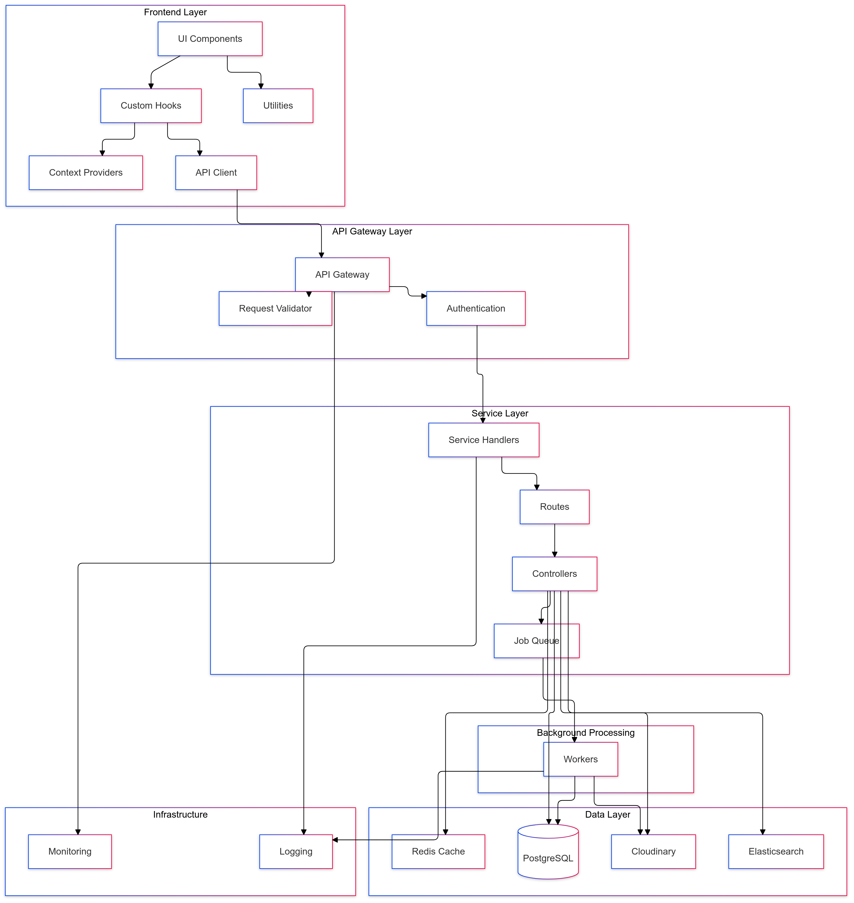

# Architecture description

## App Structure

The structure of the program follows a multiple-level layer architecture, and the code compression structure is as follows:

1. Frontend Layer
2. API Gateway Layer
3. Service Layer
4. Background Processing
5. Data Layer
6. Infrastructure



---

**Frontend Layer** is responsible for interacting with the user, handling inputs, and displaying outputs.

- **Components**: Contains all UI components and services.
- **Technologies**: Utilizes the ReactJS framework for building the user interface and Nginx for serving the application.

- **Key Features**:
  - **Responsive Design**: Responsive design for optimal use on various devices.
  - **State Management** : React Context API for efficient state management, allowing for a centralized and consistent state across the application.

---

**API Gateway Layer** Uses Axios to manage API requests and responses through well-defined services, ensuring secure and efficient data exchange with the server

- **Request Validator**:

  - Validates JWT Authorization tokens in request headers
  - Ensures request payload matches required schema
  - Sanitizes input data to prevent injection attacks
  - Manages CORS (Cross-Origin Resource Sharing) policies
  - Logs incoming requests for monitoring and debugging

- **Authentication**:
  - Manages user authentication and authorization using JWT
  - Handles token refresh mechanism
  <!-- - Implements role-based access control -->
  - Provides secure session management
  - Tracks authentication attempts and implements security measures

---

**Service Layer** : reponsible for handling request , Business logic and job queues.

- **Routes**: Defines the API endpoints and their corresponding handlers.
- **Controllers**: Contains the business logic for handling requests and responses, ensuring separation of concerns.

- **Purpose**: Manages the server-side logic, including database interactions, authentication, and API definitions.
- **Components**:

  - **Database Models and Migrations**: Defines the structure of the database and handles schema changes using Sequelize.

- **Key Features**:
  - **RESTful API Design** : RESTful API design for clear and consistent endpoints for client-server communication, adhering to REST principles..
  - **Secure Authentication**: Utilizes JWT for secure user authentication and authorization, ensuring data protection
  - **Data Validation and Error Handling** : Implements comprehensive validation and error management to ensure robust API interactions.
  - **Efficient Data Caching**: Uses Redis for caching frequently accessed data, improving response times and reducing database load.

---

**Data Layer** : Multiple specialized storage systems:

- PostgreSQL for relational data
- Redis for caching and real-time features
- Cloudinary for media storage

---

- **Technologies**: Node.js with Express for server-side logic, Redis for caching, and PostgreSQL for relational data storage.

## Database Model Design

## Core Models

### User

- Handles user authentication and profile information

```javascript
{
    id: UUID (PK),
    username: STRING(50) UNIQUE,
    email: STRING(255) UNIQUE,
    password_hash: STRING(255),
    firstName: STRING(100),
    lastName: STRING(100),
    dob: DATEONLY,
    gender: ENUM('male', 'female', 'other', 'prefer not to say'),
    country: STRING(2),
    language: STRING(2),
    bio: TEXT,
    avatar_url: STRING(255),
    website_url: STRING(255),
    location: STRING(100),
    created_at: TIMESTAMP,
    updated_at: TIMESTAMP,
    last_login: TIMESTAMP,
    is_verified: BOOLEAN,
    is_active: BOOLEAN
}
```

### Pin

- Represents user-created pins

```javascript
{
    id: UUID (PK),
    user_id: UUID (FK -> users.id),
    title: STRING(255),
    description: TEXT,
    image_url: STRING(255),
    external_url: STRING(255),
    board_id: UUID (FK -> boards.id, nullable),
    created_at: TIMESTAMP,
    updated_at: TIMESTAMP
}
```

### Board

- Collections of pins

```javascript
{
    id: UUID (PK),
    user_id: UUID (FK -> users.id),
    name: STRING(100),
    is_private: BOOLEAN,
    cover_image_url: STRING(255),
    created_at: TIMESTAMP,
    updated_at: TIMESTAMP
}
```

## Relationship Models

### BoardPins (Junction Table)

- Manages many-to-many relationship between boards and pins

```javascript
{
    board_id: UUID (PK, FK -> boards.id),
    pin_id: UUID (PK, FK -> pins.id),
    created_at: TIMESTAMP
}
```

### Followers

- Handles user follow relationships

```javascript
{
    follower_id: UUID (PK, FK -> users.id),
    following_id: UUID (PK, FK -> users.id),
    created_at: TIMESTAMP
}
```

## Interaction Models

### Comment

- User comments on pins

```javascript
{
    id: UUID (PK),
    pin_id: UUID (FK -> pins.id),
    user_id: UUID (FK -> users.id),
    content: TEXT,
    created_at: TIMESTAMP,
    updated_at: TIMESTAMP
}
```

### CommentReply

- Replies to comments

```javascript
{
    id: UUID (PK),
    comment_id: UUID (FK -> comments.id),
    user_id: UUID (FK -> users.id),
    content: TEXT,
    created_at: TIMESTAMP,
    updated_at: TIMESTAMP
}
```

### Like (Polymorphic)

- Handles likes for both pins and comments

```javascript
{
    id: UUID (PK),
    user_id: UUID (FK -> users.id),
    likeable_id: UUID,
    likeable_type: STRING,
    created_at: TIMESTAMP
}
```

## Key Features

- UUID for all primary keys
- Timestamp tracking for all models
- Soft deletion where appropriate
- Proper indexing on foreign keys and frequently queried fields
- Cascade deletion for dependent relationships

## Indexes

```sql

CREATE INDEX idx_users_id ON users(id);
CREATE INDEX idx_users_username ON users(username);
CREATE INDEX idx_users_email ON users(email);
CREATE INDEX idx_pins_user_id ON pins(user_id);
CREATE INDEX idx_boards_user_id ON boards(user_id);
CREATE INDEX idx_board_pins_board_id ON board_pins(board_id);
CREATE INDEX idx_board_pins_pin_id ON board_pins(pin_id);
CREATE INDEX idx_comments_pin_id ON comments(pin_id);
CREATE INDEX idx_comments_user_id ON comments(user_id);
CREATE INDEX idx_likes_likeable ON likes(likeable_id, likeable_type);
```

## Constraints

### Unique Constraints

- `boards`: Composite unique constraint on (`user_id`, `name`)
- `followers` Composite primary key constriant on (`follower_id`, `following_id`)
- `board_pins` Composite primary key constraint on (`board_id`,`pin_id`)

### Foreign Key Constraints

- `boards.user_id` → `users.id` (CASCADE DELETE)
- `pins.user_id` → `users.id` (CASCADE DELETE)
- `pins.board_id` → `boards.id` (SET NULL)
- `comments.user_id` → `users.id` (CASCADE DELETE)
- `comments.pin_id` → `pins.id` (CASCADE DELETE)
- `board_pins.board_id` → `boards.id` (CASCADE DELETE)
- `board_pins.pin_id` → `pins.id` (CASCADE DELETE)

### Check Constraints

- `users.dob`: Must be at least 13 years old
- `users.gender`: Must be one of ('male', 'female', 'other', 'prefer not to say')
- `users.language`: Must be 2 characters
- `users.country`: Must be 2 characters

### Not Null Constraints

- `users.username`
- `users.email`
- `pins.title`
- `pins.image_url`
- `boards.name`
- `comments.content`

```

```
